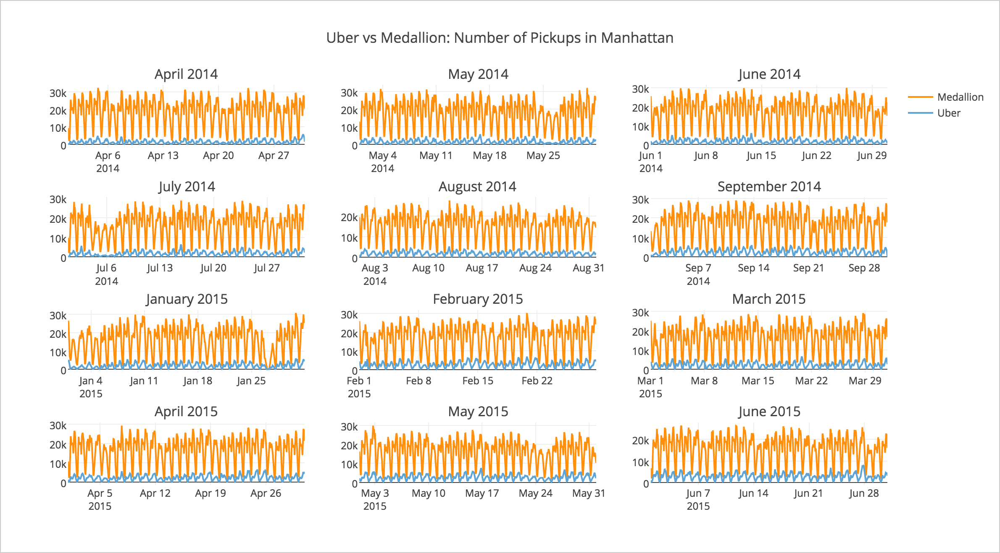
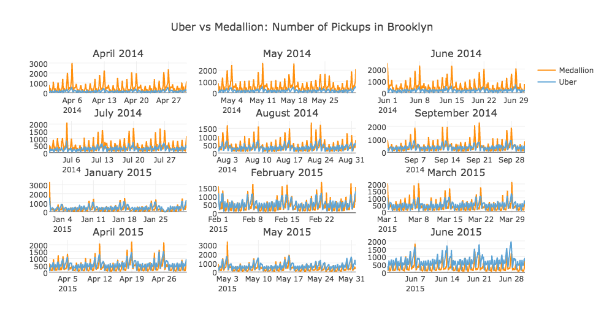

### Group Members
            
Shi Fan (sf2632)
       
Tengfei Zheng (tz869)

Vipassana Vijayarangan (vv744)

### Project Description

We intend to compare Uber pickups with Medallion pickups in New York City during time intervals Apr-Sept 2014 and Jan-Jun 2015, to be consistent with the Uber data provided by [FiveThirtyEight](https://github.com/fivethirtyeight/uber-tlc-foil-response). We are interested in finding out what kind of potential impacts that Uber may have on medallions across each and every taxi zone in NYC, by analyzing the number of pickups in each zone at an hourly level.

### Steps to Run

Run the folders in sequential order as listed below
`parsers` - generate `data/medallion` and `data/uber`
`spatialJoin` - generate `data/preprocessed`
`mapreduce` - generate `data/aggregated/medallion_agg_output`, `data/aggregated/uber14_agg_output`, and `data/aggregated/uber15_agg_output`
`postprocessing` - generate `data/aggregated/*.csv`, and `data/geo/correlation_by_zones.csv`
`analysis` - generate `plots`

### Result

In the exploratory analysis, we plotted the number of pickups in each hour over the specified 12 months in Manhattan and Brooklyn. The result is that Uber pickups tend to increase in a faster speed in Brooklyn than they do in Manhattan.

Then we attempted to find the correlation between Uber and Medallion pickups at a taxi-zone level through time series analysis. The histogram of the correlation coefficients across all taxi zones is shown below. The result is that Uber and Medallion pickups tend to be negatively correlated in more than half of the taxi zones, which shows that the number of pickups between the two services have contrasting trends. By looking at the numbers in detail, we found out that Uber pickups had been increasing while Medallions decreasing in most of these zones.

A map is a more straightforward to visualize this.

Then we went one step further by analyzing what was going on in those "Red Zones" by looking into the hourly statistics of those zones in darkest red on the map above. They are the zones that have the most contrasting trends in terms of Uber and Medallion pickups. There are 37 in total — 14 in Manhattan, 14 in Brooklyn, and 9 in Queens. For each month in "Red Zones," we aggregated the number of trips by each hour during the day, computed the Uber pickup percentage by #uber/(#uber+#medallion) for each hour, and then attempted to identify in which hour the percentage of uber pickups have been increasing the most rapidly within the specified 12 months. The speed of increase is defined by the slope of the OLS regression on the 12 data points for each hour within the 37 zones. For each of the 37 zones, the hour that has the highest slope is counted into the histogram below. It looked like Ubers had been "steeling" or filling the gap of midnight trips from Medallions in these zones where Uber pickups had gone the most popular.

The top 5 of the "Red Zones" are — Little Italy/NoLiTa, Manhattan; Jamaica Estates, Queens; Murray Hill, Manhattan; Alphabet City, Manhattan; Greenpoint, Brooklyn. We noticed that some of those top players, such as Murray Hill, Alphabet City, and Greenpoint, do not actually have convenient subway access. Therefore, the increase in the volume of Uber pickups makes sense in these zones. Before Uber had gone popular, people in these areas might have used Medallions more often than people in other areas. Now they may have just switched from Medallions to Ubers, since Uber pickups turn out to be arguably more convenient.

### Acknowledgement

Special thanks to FiveThirtyEight for providing the Uber data, TLC for providing the Medallion data, and Professor Huy V. Vo for providing instruction on the R-tree spatial join algorithm.